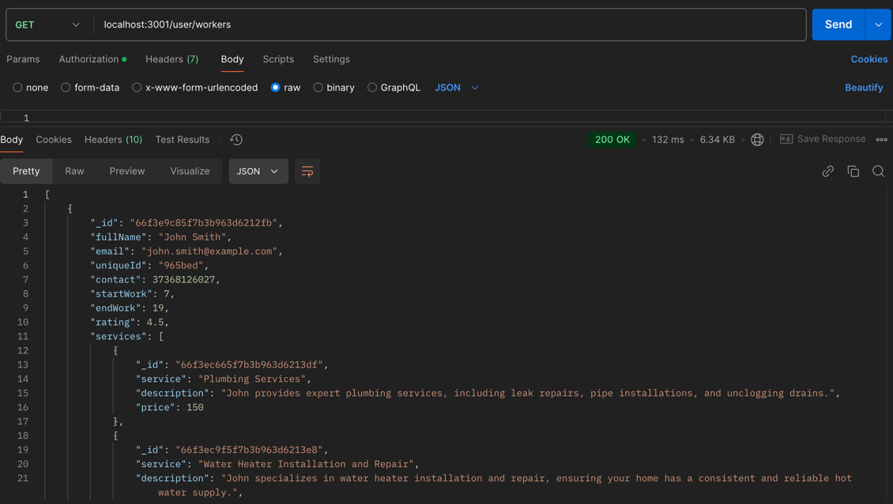
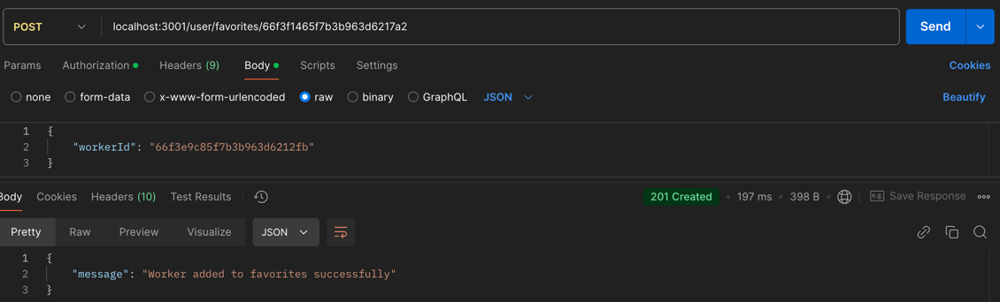
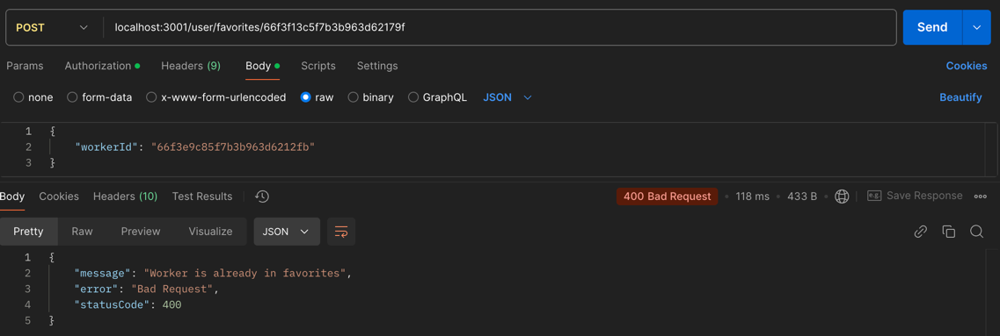
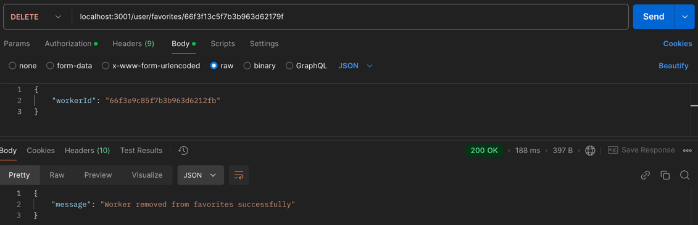
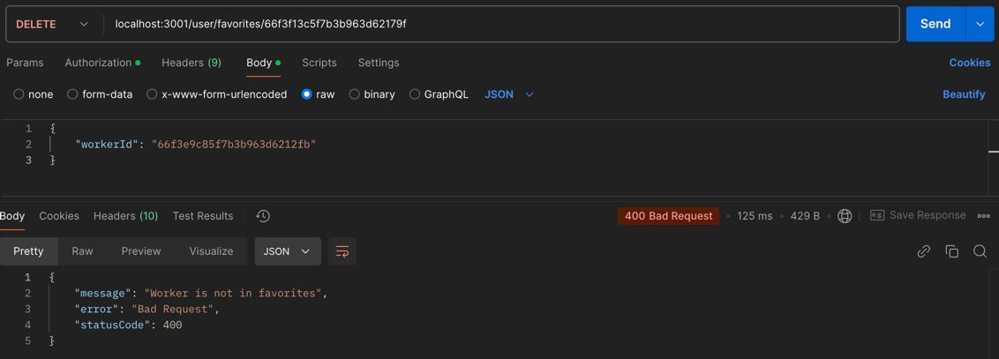

# CHANGELOG

All notable changes to this backend project will be documented in this file.

## [Unreleased]

## Week of 18.11.2024
### Added
- User functionality: View all workers
- Changed `user.service` and `user.controller`
- Created New API Endpoints:
  - Type **GET** `/user/workers`
  - **Description:** Displays all workers to the user's list.
  - **Body:**
      
### Fixed
Admin API Changes:
- **Updated Endpoints:**
  - **PUT** `/user/review/:id`  
    **Formerly:** `/user/edit/review/:id`  
    **Description:** Updates a review by its ID. This change aligns with RESTful practices by using PUT for update operations and simplifying the endpoint path.

  - **DELETE** `/user/review/:id`  
    **Formerly:** `/user/delete/review/:id`  
    **Description:** Deletes a review by its ID. This modification enhances clarity and conforms to RESTful principles by using DELETE and simplifying the resource path.

User API Changes:
- **Updated Endpoints:**
  - **POST** `/user/favorites/:userId`  
    **Formerly:** `/user/add-favorites/:userId`  
    **Description:** Adds a worker to the user's list of favorites. The update to the endpoint path and method improves consistency with RESTful design.
    
    - Case if worker exists and is not in favorites:
    - Case if worker exists and is in favorites:
  - **DELETE** `/user/favorites/:userId`  
    **Formerly:** `/user/delete-favorites/:userId`  
    **Description:** Removes a worker from the user's favorites list. This change refines the endpoint to better adhere to RESTful standards by clearly indicating resource management through the DELETE method.
    - Case if worker exists and is in favorites:
    - Case if worker exists and is not in favorites:
### Merged
- Merge pull request [#42](https://github.com/victoriaaa111/backend/pull/42) from victoriaaa111.
- Merge pull request [#41](https://github.com/victoriaaa111/backend/pull/41) from victoriaaa111.

---

## Week of 11.11.2024
### Added
- User functionality: Add favorite workers and remove from favorites(SCRUM 45)
  - Changed `user.schema`, `user.service` and `user.controller`
- Changed findUser such that it displays now favorite workers for each user.
- Created New API Endpoints:

- Type **POST** `/add-favorite/:id`
  - **Description:** Adds a favorite worker to the user's list.
  - **Body:**
    ```json
    {
      "workerId": "66f3e9c85f7b3b963d6212fb"
    }
    ```
    Case if worker exists and is not in favorites.
    ```json
    {
    "message": "Worker added to favorites successfully"
    }
    ```
    Case if worker exists and is in favorites.
    ```json
    {
    "message": "Worker is already in favorites",
    "error": "Bad Request",
    "statusCode": 400
    }
    ```

- Type **DELETE** `/delete-favorites/:id`
  - **Description:** Removes a favorite worker from the user's list.
  - **Body:**
    ```json
    {
      "workerId": "66f3e9c85f7b3b963d6212fb"
    }
    ```
    Case if worker exists and is in favorites.
    ```json
    {
    "message": "Worker removed from favorites successfully"
    }
    ```
    Case if worker exists and is not in favorites.
    ```json
    {
    "message": "Worker is not in favorites",
    "error": "Bad Request",
    "statusCode": 400
    }
    ```

### Merged
- Merge pull request [#37](https://github.com/victoriaaa111/backend/pull/37) from victoriaaa111 (SCRUM 45).
- Merge pull request [#36](https://github.com/victoriaaa111/backend/pull/36) from victoriaaa111 (SCRUM 45).

---
## Study Process (October 2024 - November 2024)
### Research and Skill Development
- **SSL Certificates**: Studied and researched SSL certificates to enhance security protocols. (https://medium.com/@m.fareed607/how-to-set-up-an-nginx-reverse-proxy-server-and-enable-https-with-certbot-bbab9feb6338, https://www.digitalocean.com/community/tutorials/how-to-create-a-self-signed-ssl-certificate-for-nginx-on-centos-7#step-1-create-the-ssl-certificate)
- **Coding Skills Improvement**: Completed various courses on Udemy to improve backend development skills.
- **Advanced Git Course**: Completed an advanced course on Gitflow Workflow (https://www.atlassian.com/git/tutorials/comparing-workflows/gitflow-workflow).
- **Midterm Report**: Enhanced the quality and structure of the midterm report.
- **Market Research**: Conducted further market research to better understand target audiences and requirements.
---
## Week of 23.09.2024
### Added
- Admin functionality: retrieve orders, change status, and reschedule orders (SCRUM 47).
- Reviews functionality: edit rating review, delete review, and retrieve workers with no ratings (SCRUM 7).
- Retrieve all reviews for a worker.

### Fixed
- Fixed bug in guards.
- Resolved bug with `accessToken`.

### Merged
- Merge pull requests [#34](https://github.com/victoriaaa111/backend/pull/34), [#33](https://github.com/victoriaaa111/backend/pull/33), and [#32](https://github.com/victoriaaa111/backend/pull/32) from victoriaaa111 (SCRUM 47, SCRUM 7).
- Merge pull request [#31](https://github.com/victoriaaa111/backend/pull/31) and [#30](https://github.com/victoriaaa111/backend/pull/30): fixed guards bug and updated `refreshToken` API for all user types, guarded all routes with auth.

---

## Week of 16.09.2024
### Added
- Auth guard for admin APIs.
- SSL certificate integration for enhanced security.
- Duplicate service prevention for the same worker.
- Retrieve orders excluding canceled or declined orders.
- Periodic calculation of worker ratings (every Sunday).
- API for users to add reviews, retrieve worker availability, and cancel orders.
- Workers can now change the status of an order (SCRUM 60).
- Retrieve and display orders for improved order management (SCRUM 58).
- `createOrder` functionality added; replaced `username` with `uniqueId` for workers/users.

### Changed
- Modified service search route from `POST` to `GET`.
- Reorganized service search functionality with service type, rating, and combined search options.

### Fixed
- Checked non-empty fields for updates to worker/service.
- Fixed `serviceId` alignment issue when retrieving a worker.

### Merged
- Merge pull requests [#29](https://github.com/victoriaaa111/backend/pull/29), [#28](https://github.com/victoriaaa111/backend/pull/28), [#27](https://github.com/victoriaaa111/backend/pull/27), [#26](https://github.com/victoriaaa111/backend/pull/26), and [#25](https://github.com/victoriaaa111/backend/pull/25) from victoriaaa111 (SCRUM 56, SCRUM 61, SCRUM 32).
- Merge pull requests [#24](https://github.com/victoriaaa111/backend/pull/24), [#22](https://github.com/victoriaaa111/backend/pull/22), and [#21](https://github.com/victoriaaa111/backend/pull/21): resolved rating calculation and bug fixes for serviceId, periodic rating updates.

---

## Week of 09.09.2024
### Added
- CI/CD workflow for build and deploy to EC2 instance.
- Adjusted port mapping to match app requirements.
- Password management functions: change, forgot, and reset password for users/workers/admins.
- Ability to activate/deactivate users/workers and retrieve all users/workers.
- Worker signup and updated authentication for admin.
- Profile retrieval and functions to add/delete services.
- Admin login functionality.
- CORS support for frontend.

### Changed
- Modified JSON structure for `findOne` with additional signup details.

### Merged
- Merge pull requests [#13](https://github.com/victoriaaa111/backend/pull/13), [#12](https://github.com/victoriaaa111/backend/pull/12), [#11](https://github.com/victoriaaa111/backend/pull/11), [#10](https://github.com/victoriaaa111/backend/pull/10), [#9](https://github.com/victoriaaa111/backend/pull/9), and [#8](https://github.com/victoriaaa111/backend/pull/8) from victoriaaa111 (SCRUM 18, SCRUM 51).
- Merge pull requests [#7](https://github.com/victoriaaa111/backend/pull/7) and [#6](https://github.com/victoriaaa111/backend/pull/6): added worker signup, profile retrieval, and authentication process improvements.

---

## Week of 02.09.2024
### Initial Release
- Initial project setup and commit with core backend functionalities:
    - Admin login.
    - Authentication and authorization setup.
    - Forgot, reset, and change password functionalities.
- Added Server 

### Merged
- Merge pull requests [#5](https://github.com/victoriaaa111/backend/pull/5), [#4](https://github.com/victoriaaa111/backend/pull/4), and [#3](https://github.com/victoriaaa111/backend/pull/3) from victoriaaa111: added server, CORS, and initial authentication setup.

---

## 01.09.2024
### Initial Commit
- Initial setup of the project structure.
- First commits and basic server setup.
